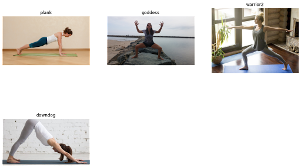
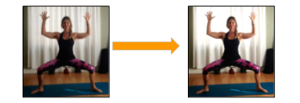
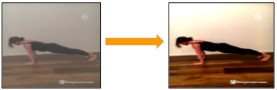
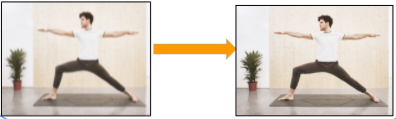
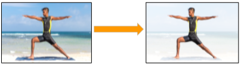
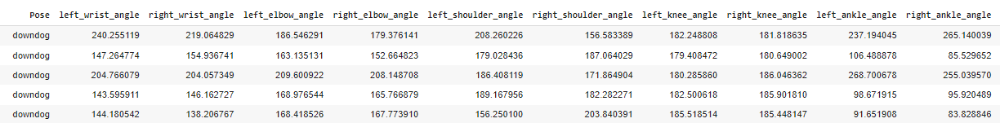
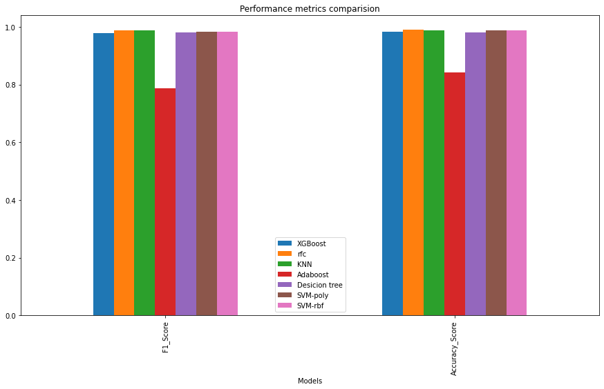

# Yoga-Pose-Estimator

##Description 

An ML model that classifies yoga pose in to  4 most famous asanas namely downward dog, plank pose, tree pose, goddess pose and warrior-2 pose using Mediapipe Blazepose for feature extraction .

##DataSet

Dataset is a combined Dataset of :
- https://www.kaggle.com/niharika41298/yoga-poses-dataset
- https://sites.google.com/view/yoga-82/home
- The combined dataset contains- 900 + diverse images (Children , Women and
Men) for four different Yoga Asanas.

##Preprocessing Images

###Rescaling images
Images are first resized to reduce computation.

###Brightness Adjustment

Gamma correction is a non-linear adjustment to individual pixel values. In image normalization, linear operations are carried out on individual pixels, gamma correction carries out a non-linear operation on the source image pixels, and can cause saturation of the image being altered.

###Contrast Adjustments

- Adjusts image contrast by its histogram. 
- To enhance contrast, spreads out intensity range of image.
- This allows the image’s areas with lower contrast to gain a higher contrast.

###Sharpening Images

- Edge detector used to compute the second derivatives of an image. 
- This determines if a change in adjacent pixel values is from an edge or continuous progression. Laplacian filter kernels usually contain negative values in a cross pattern, centered within the array. The corners are either zero or positive values. The center value can be either negative or positive.

###Body Segmentation

- Media Pipe Segmentation function is used to blur the background of the image
- The mask has the same width and height as the input image, and contains values in [0.0, 1.0] where 1.0 and 0.0 indicate “human” and “background” pixel respectively.

###Pose Landmarks

- Media pipe blaze pose is used to extract 3D coordinates of  33 joints from the image
- x and y: Landmark coordinates normalized to [0.0, 1.0] by the image width and height respectively.
- z: Represents the landmark depth with the depth at the midpoint of hips being the origin, and the smaller the value the closer the landmark is to the camera. 

###Angle Computation

Key angles at ( knee , elbow , shoulder , ankle ) are calculated from the points extracted and labelled with respective Asana name
Angle at a joint is given by:
> angle = degrees(atan2(y3 - y2, x3 - x2) - math.atan2(y1 - y2, x1 - x2))

##ML model results:

Train and test machine learning algorithms (Random Forest, SVC, Decision Tree, KNN, Adaboost, RFC) using the data generated to find which model best fits.

