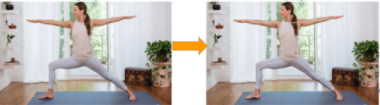

# Yoga-Pose-Estimator

## Description 

An ML model that classifies yoga pose in to  4 most famous asanas namely downward dog, plank pose, tree pose, goddess pose and warrior-2 pose using Mediapipe Blazepose for feature extraction .


## DataSet

Dataset is a combined Dataset of :
- https://www.kaggle.com/niharika41298/yoga-poses-dataset
- https://sites.google.com/view/yoga-82/home
- The combined dataset contains- 900 + diverse images (Children , Women and
Men) for four different Yoga Asanas.


## Preprocessing Images

### Rescaling images
Images are first resized to reduce computation.

```py 

DESIRED_HEIGHT = 480
DESIRED_WIDTH = 480

def resize_2D_array(overall_images):
    new_arr_for_outerdirectory = []
    for i in range(len(overall_images)):
      col = dict[i]
      new_array_for_subdirectory = []
      for j in range(len(overall_images[i])):


        img = overall_images[i][j]
        h, w = img.shape[:2]

        if h < w:
          img = cv2.resize(img, (DESIRED_WIDTH, math.floor(h/(w/DESIRED_WIDTH))))
          print(img.shape)
        

        else:
          img = cv2.resize(img, (math.floor(w/(h/DESIRED_HEIGHT)), DESIRED_HEIGHT))
          print(img.shape)
   

        #appending the image to a new array
        new_array_for_subdirectory.append(img)
      new_arr_for_outerdirectory.append(new_array_for_subdirectory)

    return new_arr_for_outerdirectory


```
### Brightness Adjustment

Gamma correction is a non-linear adjustment to individual pixel values. In image normalization, linear operations are carried out on individual pixels, gamma correction carries out a non-linear operation on the source image pixels, and can cause saturation of the image being altered.


```py

#for brightness improvement

def gammaCorrection(src, gamma):
    invGamma = 1 / gamma
 
    table = [((i / 255) ** invGamma) * 255 for i in range(256)]
    table = np.array(table, np.uint8)
 
    return cv2.LUT(src, table)

def isbright(image, dim=10):
    # Resize image to 10x10
    image = cv2.resize(image, (dim, dim))
    # Convert color space to LAB format and extract L channel
    L, A, B = cv2.split(cv2.cvtColor(image, cv2.COLOR_BGR2LAB))
    # Normalize L channel by dividing all pixel values with maximum pixel value
    L = L/np.max(L)
    # Return True if mean is greater than thresh else False
    return np.mean(L)

def changeBrightness(image):

  if (isbright(image) < 0.5):
    gammaImg = gammaCorrection(image, 1)
  elif (isbright(image) > 0.85):
    gammaImg = gammaCorrection(image, 0.75)
  else:
    gammaImg = image
  return gammaImg


def improve_brightness(overall_images):
    new_arr = []
    for i in range(len(overall_images)):
      col = dict[i]
      new_array_1 = []
      for j in range(len(overall_images[i])):

        img = changeBrightness(overall_images[i][j])
        #appending the image to a new array
        new_array_1.append(img)
      new_arr.append(new_array_1)
    return new_arr
  
```
### Contrast Adjustments

- Adjusts image contrast by its histogram. 
- To enhance contrast, spreads out intensity range of image.
- This allows the image’s areas with lower contrast to gain a higher contrast.


```py

# import the neccessasry library
from skimage.exposure import is_low_contrast
def histogram_equalization(img_in):
# segregate color streams
    b,g,r = cv2.split(img_in)
    h_b, bin_b = np.histogram(b.flatten(), 256, [0, 256])
    h_g, bin_g = np.histogram(g.flatten(), 256, [0, 256])
    h_r, bin_r = np.histogram(r.flatten(), 256, [0, 256])
# calculate cdf    
    cdf_b = np.cumsum(h_b)  
    cdf_g = np.cumsum(h_g)
    cdf_r = np.cumsum(h_r)
    
# mask all pixels with value=0 and replace it with mean of the pixel values 
    cdf_m_b = np.ma.masked_equal(cdf_b,0)
    cdf_m_b = (cdf_m_b - cdf_m_b.min())*255/(cdf_m_b.max()-cdf_m_b.min())
    cdf_final_b = np.ma.filled(cdf_m_b,0).astype('uint8')
  
    cdf_m_g = np.ma.masked_equal(cdf_g,0)
    cdf_m_g = (cdf_m_g - cdf_m_g.min())*255/(cdf_m_g.max()-cdf_m_g.min())
    cdf_final_g = np.ma.filled(cdf_m_g,0).astype('uint8')
    cdf_m_r = np.ma.masked_equal(cdf_r,0)
    cdf_m_r = (cdf_m_r - cdf_m_r.min())*255/(cdf_m_r.max()-cdf_m_r.min())
    cdf_final_r = np.ma.filled(cdf_m_r,0).astype('uint8')
    
# merge the images in the three channels
    img_b = cdf_final_b[b]
    img_g = cdf_final_g[g]
    img_r = cdf_final_r[r]
  
    img_out = cv2.merge((img_b, img_g, img_r))
# validation
    equ_b = cv2.equalizeHist(b)
    equ_g = cv2.equalizeHist(g)
    equ_r = cv2.equalizeHist(r)
    equ = cv2.merge((equ_b, equ_g, equ_r))
  
    return img_out
    
def improve_contrast(overall_images):
    new_arr = []
    for i in range(len(overall_images)):
      col = dict[i]
      new_array_1 = []
      for j in range(len(overall_images[i])):
        
        img = overall_images[i][j]
        if(is_low_contrast(img, fraction_threshold=0.05, lower_percentile=1, upper_percentile=99, method='linear')):
          img = histogram_equalization(img)

        #appending the image to a new array
        new_array_1.append(img)
      new_arr.append(new_array_1)
    return new_arr


newarray = improve_contrast(newarray)
```
### Sharpening Images

- Edge detector used to compute the second derivatives of an image. 
- This determines if a change in adjacent pixel values is from an edge or continuous progression. Laplacian filter kernels usually contain negative values in a cross pattern, centered within the array. The corners are either zero or positive values. The center value can be either negative or positive.


```py
def sharpenimage(image):
  laplacian_var = cv2.Laplacian(image, cv2.CV_64F).var()
  if laplacian_var < 100:
    kernel = np.array([[0, -1, 0],
                      [-1, 5,-1],
                      [0, -1, 0]])

    sharpened_img = cv2.filter2D(src=image, ddepth=-1, kernel=kernel)
  else:
    sharpened_img = image
  return sharpened_img

def improve_sharpening(overall_images):
    new_arr = []
    for i in range(len(overall_images)):
      col = dict[i]
      new_array_1 = []
      for j in range(len(overall_images[i])):
        img = sharpenimage(overall_images[i][j])
        #appending the image to a new array
        new_array_1.append(img)
      new_arr.append(new_array_1)

    return new_arr

```
## Body Segmentation

- Media Pipe Segmentation function is used to blur the background of the image
- The mask has the same width and height as the input image, and contains values in [0.0, 1.0] where 1.0 and 0.0 indicate “human” and “background” pixel respectively.


## Pose Landmarks

- Media pipe blaze pose is used to extract 3D coordinates of  33 joints from the image
- x and y: Landmark coordinates normalized to [0.0, 1.0] by the image width and height respectively.
- z: Represents the landmark depth with the depth at the midpoint of hips being the origin, and the smaller the value the closer the landmark is to the camera. 



## Angle Computation

Key angles at ( knee , elbow , shoulder , ankle ) are calculated from the points extracted and labelled with respective Asana name
Angle at a joint is given by:
> angle = degrees(atan2(y3 - y2, x3 - x2) - math.atan2(y1 - y2, x1 - x2))


```py
def calculateAngle(landmark1, landmark2, landmark3):

 
    x1, y1, _ = landmark1
    x2, y2, _ = landmark2
    x3, y3, _ = landmark3
 
    angle = math.degrees(math.atan2(y3 - y2, x3 - x2) - math.atan2(y1 - y2, x1 - x2))
    
    # Check if the angle is less than zero. 
    if angle< 0:
 
        # Add 360 to the found angle.
        angle += 360
    
    return angle
 ```
 
## ML model results:

Train and test machine learning algorithms (Random Forest, SVC, Decision Tree, KNN, Adaboost, RFC) using the dataframe (csv) generated to find which model best fits.


